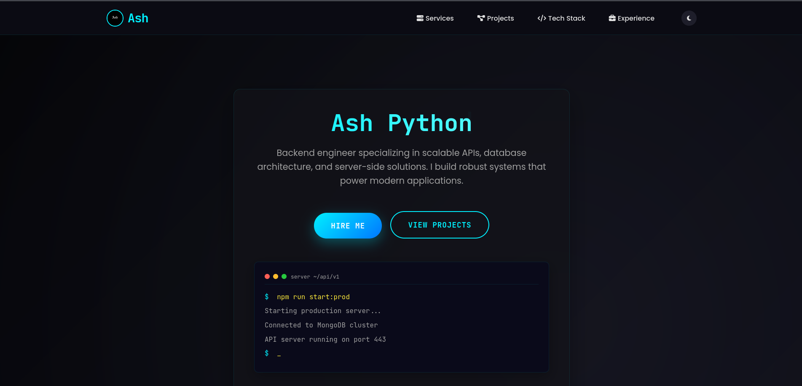
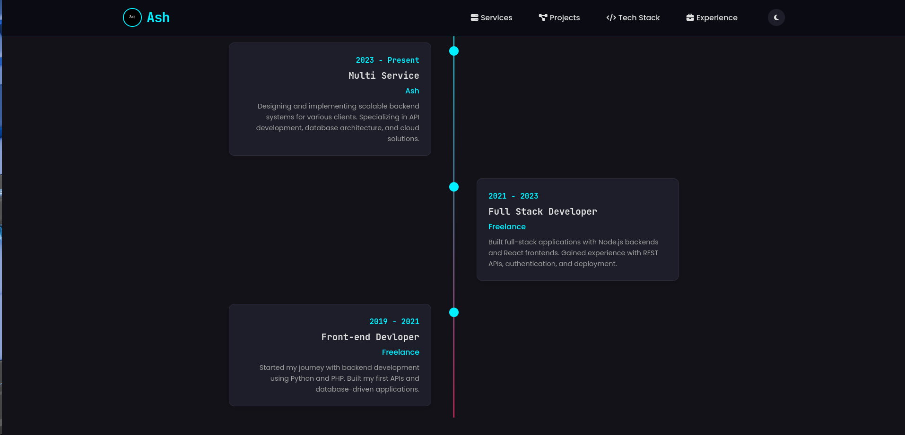
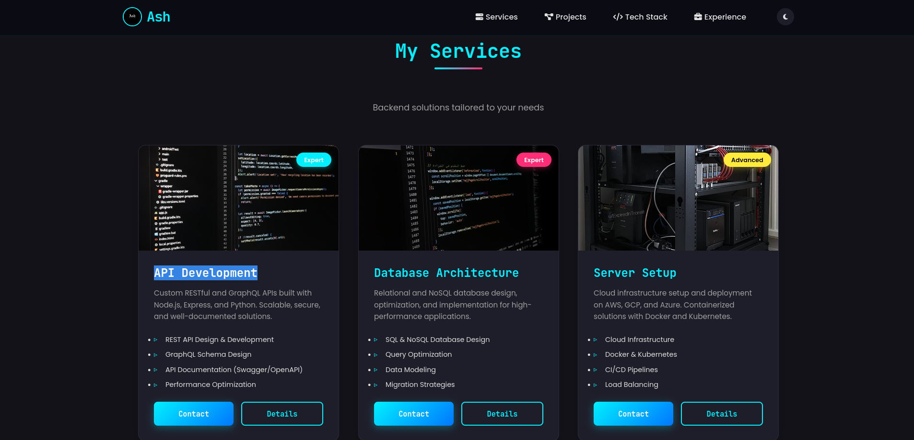
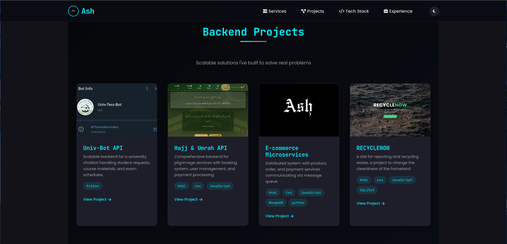

# 🌟 Achraf's Personal Portfolio


Welcome to my **Personal Portfolio Website** — a creative space where I showcase my projects, skills, and passion for web development.  
Built with pure **HTML**, **CSS**, and **JavaScript**, this site blends sleek design with smooth animations to offer an engaging user experience.

---

## 🚀 Live Demo

🔗 [Explore the live portfolio here!](https://portfollio-ww0h.onrender.com)

---

## 🔥 Why This Portfolio Rocks

- 💎 **Clean and Responsive:** Works flawlessly on all devices  
- ⚡ **Fast Loading:** Optimized for performance and speed  
- 🎨 **Custom Animations:** Adding flair with smooth, subtle animations  
- 🛠️ **Built with:** Vanilla HTML, CSS, and JavaScript  
- 📸 **Showcasing:** Projects, skills, services with crisp visuals  

---

## 📁 Project Structure

```plaintext
.
├── index.html              # Main entry page
└── static/
    ├── css/                # CSS files
    ├── js/                 # JavaScript files
    ├── images/             # Assets & project images
    └── images-2/           # Screenshots for README display
```

---

## 🎥 Sneak Peek

| Home | Personal Info | Services | Skills |
|-------|--------------|----------|--------|
|  |  |  |  |

---

## 🛠️ Technologies Used

| HTML5 | CSS3 | JavaScript |
|-------|------|------------|
|  |  |  |

---

## 💻 How to Run Locally

```bash
git clone https://github.com/your-username/portfolio.git
cd portfolio
open index.html  # or start index.html on Windows
```

Just open the `index.html` in any modern browser — no build steps or servers needed!

---

## 📜 License

Licensed under the [MIT License](LICENSE). Feel free to use and adapt!

---

## 🙌 Author

**Achraf** – passionate about crafting beautiful web experiences.

---

*Thanks for visiting! 🚀*
